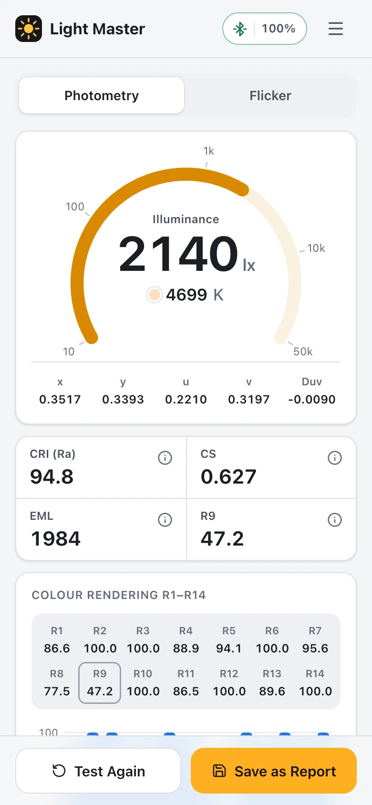
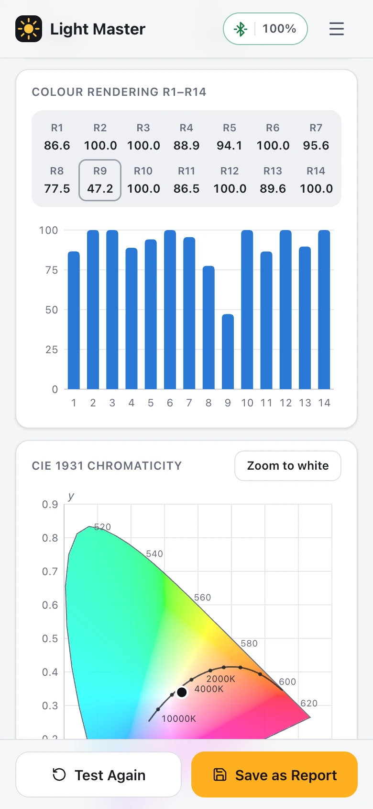
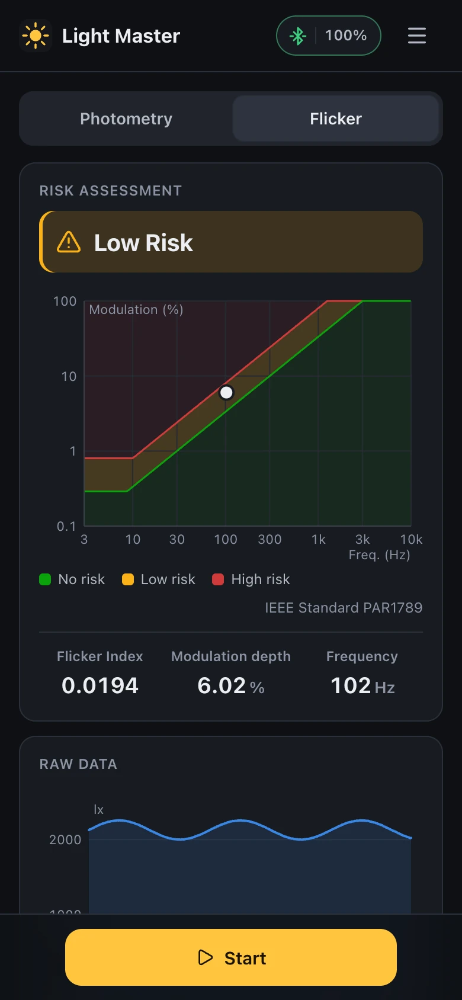
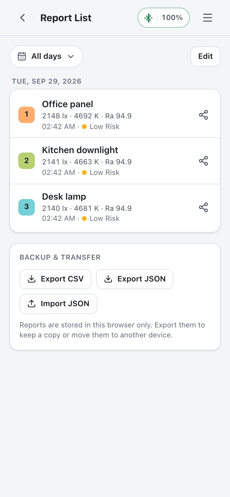

# Light Master 4 Web

A web version of the Opple Light Master 4 screens from the OPPLE Smart app: photometry (lux, CCT, x/y, u/v, Duv, Ra, R1–R14, CS, EML), flicker (IEEE PAR1789 risk, flicker index, modulation depth, frequency, waveform) and saved reports. It talks to the meter directly over Web Bluetooth. Nothing leaves the browser.

The numbers come from the official app's own algorithms and coefficients, extracted from the decompiled iOS and Android apps and checked against real LM4 captures. See [OMISSIONS.md](OMISSIONS.md) for what differs from the app.

**Open it:** https://khromov.github.io/opple-light-master-4-web-ui/ (or [try the demo](https://khromov.github.io/opple-light-master-4-web-ui/?demo) with a simulated meter, no hardware needed)

<table>
  <tr>
    <td></td>
    <td></td>
    <td></td>
    <td></td>
  </tr>
  <tr>
    <td align="center">Photometry</td>
    <td align="center">Colour rendering</td>
    <td align="center">Flicker (dark mode)</td>
    <td align="center">Reports</td>
  </tr>
</table>

## Using it

1. Use Chrome or Edge (desktop or Android). Safari and Firefox have no Web Bluetooth; on iPhone/iPad use a Web Bluetooth browser such as Bluefy.
2. Wake the meter (push the inner part out; the LED flashes slowly) and close the Opple app — the meter accepts one connection at a time.
3. Press **Start** and pick **SigMesh** (the Light Master 4's Bluetooth name).
4. **Photometry** measures continuously until Stop; **Save as Report** also captures flicker, as the app does. **Flicker** takes one measurement per Start.

Flicker needs a moderate light level: roughly 300–3,000 lx. Below ~100 lx the meter's flicker sensor is close to its noise floor, and above ~4,000 lx it overloads (its output falls back towards the dark level). The UI warns in both cases.

`?demo` runs the whole UI against a simulated meter.

## Development

```bash
npm install
npm run dev      # http://localhost:5173 (localhost counts as a secure context for Web Bluetooth)
npm test         # protocol, maths, session (simulated meter) and real-capture tests
npm run check    # svelte-check + tsc
npm run build    # static site in dist/
```

With `LM4_LOG_FILE=/path/to/file npm run dev`, the dev server appends the page's diagnostics log (including raw BLE frames) to that file, which helps when debugging against real hardware.

Deployment: `.github/workflows/deploy.yml` tests, builds and publishes `dist/` to GitHub Pages on every push to `main` (set the repository's Pages source to "GitHub Actions"). The build uses relative paths, so it works under any Pages sub-path.

| Path | What |
| --- | --- |
| `src/lib/ble/protocol.ts` | Nordic UART framing, reassembly, measurement/calibration/flicker payloads |
| `src/lib/ble/meter.ts` | Web Bluetooth session: connect, calibration, polling, flicker capture sequence, reconnect, diagnostics |
| `src/lib/ble/fake-meter.ts` | Simulated LM4 for tests and `?demo` |
| `src/lib/science/lm4.ts`, `lm4-model-data.ts` | XYZ, CCT, Duv, the app's CRI/EML/CS regression model, battery |
| `src/lib/science/flicker.ts` | Modulation depth, flicker index, FFT frequency, risk class, capture refinement |
| `src/lib/format.ts` | The app's display rules |
| `src/lib/reports.ts` | Local reports (raw inputs, recomputed on open), export/import, share links |

## Protocol summary

Nordic UART service `6e400001-b5a3-f393-e0a9-e50e24dcca9e`; commands are written without response to `…0003` and answered by notifications on it. A message is an 11-byte header `[00 13 00 00 seq 00 len 00 00 opHi opLo]` plus body, split into ≤20-byte fragments (`0x00` single, `0x80` first with the total length, `0xA0|i` middle, `0xC0|i` last). Replies carry opcode + 1 and echo `seq` at byte 5.

| Request | Reply | Payload |
| --- | --- | --- |
| `0x0A00` measure | `0x0A01` | 9 × u16 BE (F1–F8 at 415–680 nm, clear), an unused word (probably NIR), battery |
| `0x0A04` calibration | `0x0A05` | 9 × float32 LE per-channel factors |
| `0x0A0A` `[0, p>>8, p]` flicker | 4 × `0x0A0B` | page, gain range, an embedded measurement, then 260/260/260/244 packed 12-bit samples; `p` = 25, 146 or 11 (26 / 150 / 12.285 µs per sample) |

## Credits

Web Bluetooth session and LM4 pipeline ported from [sunday-light-meter](https://github.com/natmart-in/sunday-light-meter) (MIT); flicker protocol first documented by [opple-bridge](https://github.com/gabrielebaudo/opple-bridge) (MIT). See [THIRD_PARTY_NOTICES.md](THIRD_PARTY_NOTICES.md).

Not affiliated with Opple. Opple and Light Master are trademarks of their owner.
